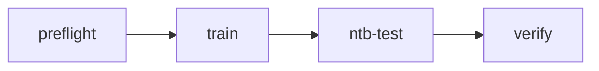

# gm → ntb R1-3 编排

薄编排层：五种模式、变量契约、`record-run.json`、子 skill 路由。命令细节见各子 skill。

## 五种模式

| 模式 | 流程 | 何时选 |
|:---|:---|:---|
| **A** | gm 训练 → ntb test | R1-3 全流程（gm 路径） |
| **B** | ntb 训练 → ntb test | R1-3 全流程（ntb 路径） |
| **C** | 仅 gm 训练 | 只上云训练 |
| **D** | 仅 ntb 训练 | 只 ntb 训练 |
| **E** | **仅 ntb test** | **已有 checkpoint**，不训练 |

触发词（模式 **E**）：`只测试`、`只 test`、`跑 test`、`test-only`、`E2E 的 test 段`。

```text
  A: gm ───────────────► ntb test (gm)
  B:      ntb ─────────► ntb test (ntb)
  C: gm ──► 停          D: ntb ──► 停
  E: (跳过训练) ───────► ntb test
```

## 子 Skill 路由

| Skill | 模式 |
|:---|:---|
| [`gm-ntb-preflight`](../gm-ntb-preflight/SKILL.md) | 全部（E 用 `-For ntb`） |
| [`gm-ntb-gm-train`](../gm-ntb-gm-train/SKILL.md) | A、C |
| [`gm-ntb-ntb-train`](../gm-ntb-ntb-train/SKILL.md) | B、D |
| [`gm-ntb-ntb-test`](../gm-ntb-ntb-test/SKILL.md) | A、B、**E** |

## 模式选择（用户未说明时）

```text
A — gm 训练 + ntb test
B — ntb 训练 + ntb test
C — 仅 gm 训练
D — 仅 ntb 训练
E — 仅 ntb test（已有训练产物）
```

模式 **E** 子类型：**E-gm**（`GM_TASK_ID`）/ **E-ntb**（`TRAIN_JOB_ID`）。

---

## 模式 E：仅 ntb test（重点）

### 前置检查

```powershell
# 1) 校验 record-run.json 字段齐全
powershell -File .cursor\skills\gm-ntb-r1\scripts\read-record-run.ps1

# 2) load_run 缺失时，从 gm 日志解析并写回
powershell -File .cursor\skills\gm-ntb-r1\scripts\resolve-load-run.ps1 -TaskId TASK_xxx -UpdateRecord

# 3) ntb 环境
powershell -File .cursor\skills\gm-ntb-preflight\scripts\preflight.ps1 -For ntb
```

### 入口条件

| 字段 | E-gm | E-ntb |
|:---|:---:|:---:|
| `load_run` | ✓ | ✓ |
| `checkpoint` | ✓ | ✓ |
| `commit_sha` | ✓ | ✓ |
| `gm_task_id` | ✓ | — |
| `train_job_id` | — | ✓ |
| 训练机 Agent | ✓ | ✓ |

### 执行步骤

1. `read-record-run.ps1` 通过
2. [`gm-ntb-ntb-test`](../gm-ntb-ntb-test/SKILL.md)：`test run --watch` → `verify-test.ps1`
3. 更新 `record-run.json`：`mode` → `E`，填入 `test_job_id`

### 续接场景

| 从 | 用户说 | 动作 |
|:---|:---|:---|
| C 完成 | 「跑 test」 | **E-gm** |
| D 完成 | 「跑 test」 | **E-ntb** |
| 任意 | 「只测试」 | **E**（读 record-run） |

---

## 模式 A / B（全流程）



- **A**：preflight → gm-train → 用户确认 → ntb-test (`source=gm`)
- **B**：preflight `-For ntb` → ntb-train → ntb-test (`source=ntb`)

训练未完成不进 test。

## 模式 C / D（仅训练）

训练结束即停，不调用 ntb-test。更新 `record-run.json` 后汇报四元组；用户后续可说「只测试」进入 **E**。

---

## 变量契约

| 变量 | A | B | C | D | E | 说明 |
|:---|:---:|:---:|:---:|:---:|:---:|:---|
| `run_name` | ✓ | ✓ | ✓ | ✓ | ✓ | 如 `r1_3_test` |
| `commit_sha` | ✓ | ✓ | ✓ | ✓ | ✓ | 训练 commit |
| `task` | ✓ | ✓ | ✓ | ✓ | ✓ | 默认 `x1_dh_stand` |
| `gm_task_id` | ✓ | — | ✓ | — | E-gm | |
| `train_job_id` | — | ✓ | — | ✓ | E-ntb | |
| `load_run` | ✓ | ✓ | ✓ | ✓ | ✓ | `<时间戳><run_name>` |
| `checkpoint` | ✓ | ✓ | ✓ | ✓ | ✓ | 如 `220` |
| `test_job_id` | ✓ | ✓ | — | — | ✓ | test 完成后 |
| `test_source` | gm | ntb | — | — | gm/ntb | E 必填 |

`load_run` 示例：`2026-07-02_14-12-51r1_3_test`  
产物：`logs/x1_dh_stand/exported_data/<load_run>/model_<N>.pt`

## record-run.json

路径：`.cursor/skills/gm-ntb-r1/record-run.json`（从 `record-run.example.json` 复制，**已 gitignore**）。

辅助脚本（本目录 `scripts/`）：

| 脚本 | 用途 |
|:---|:---|
| `read-record-run.ps1` | 校验模式 E 必填字段 |
| `resolve-load-run.ps1` | 从 gm 日志解析 `load_run` |

## 三端分工

| 位置 | 需要 Agent |
|:---|:---|
| 本机 | 全部 |
| 云 Server | A/B/D/E 的 ntb 阶段 |
| 训练机 Agent | A/B/D/**E** 须启动；**C** 不需要 |

## 全局禁止

- 不写 API Key 进 skill / git
- A/B：训练未完成不进 test
- C/D：不主动 test（除非用户改口 → **E**）
- E：不创建训练任务；缺 checkpoint 则中止
- PowerShell 用 `gm.ps1` / `ntb.ps1`

## 汇报模板

```text
【R1-3】模式: A|B|C|D|E  test_source: gm|ntb|—
GM_TASK_ID / TRAIN_JOB_ID / TEST_JOB_ID
LOAD_RUN / CHECKPOINT / COMMIT_SHA
状态: 进行中 | 等待确认 | 完成
下一步: <子 skill>
```

## 相关文档

| 文档 | 内容 |
|:---|:---|
| [czy/skills/cli-readme.md](../../../czy/skills/cli-readme.md) | **ntb CLI 完整参考** |
| [.trae/skills/gm-cli/SKILL.md](../../../.trae/skills/gm-cli/SKILL.md) | gm CLI 参考 |
| [README.md](../README.md) | Skill 索引 |
