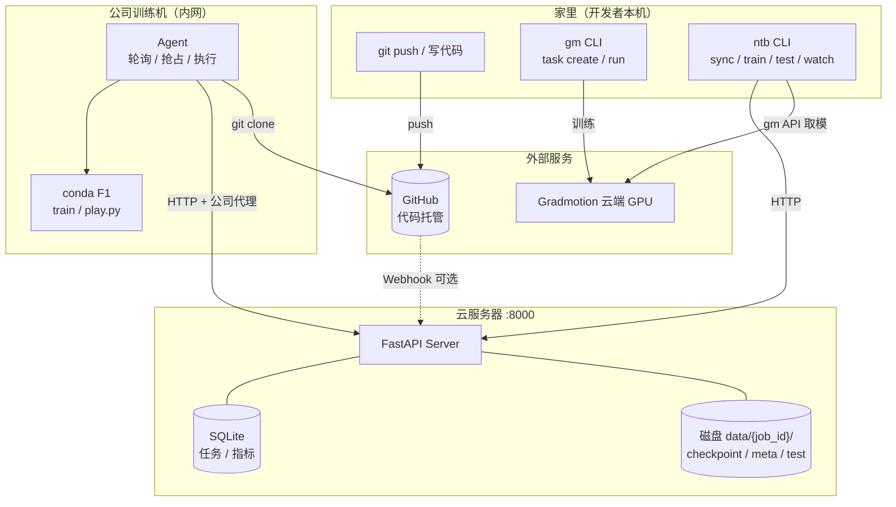
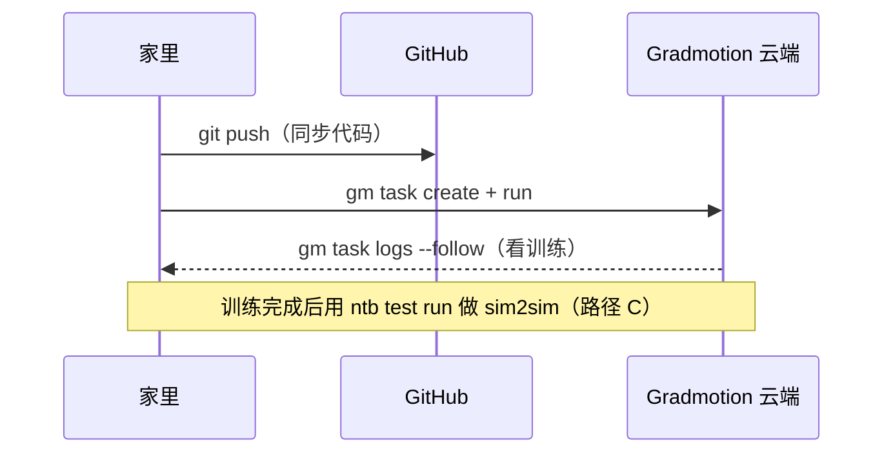
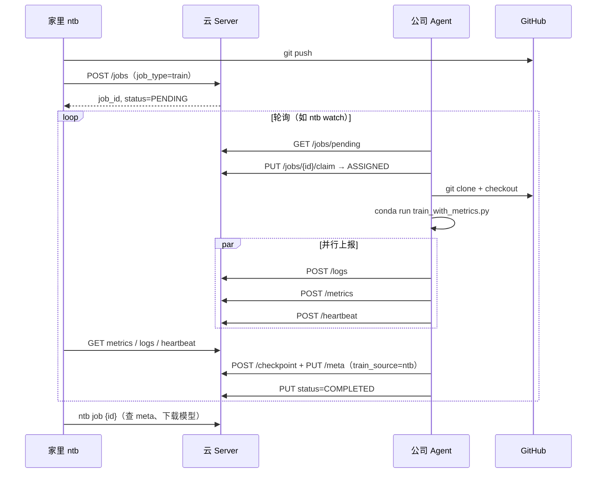
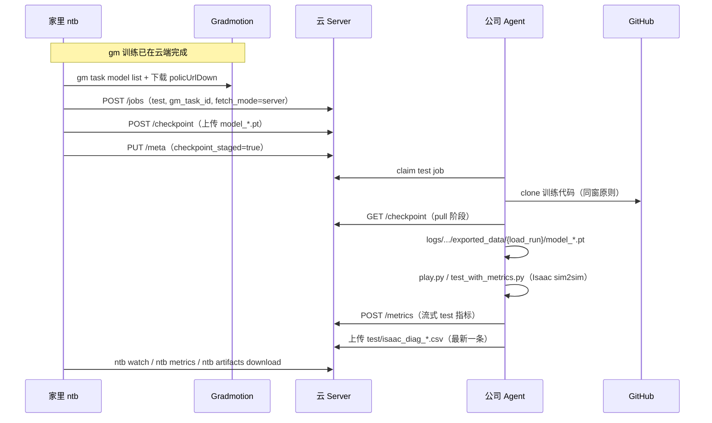
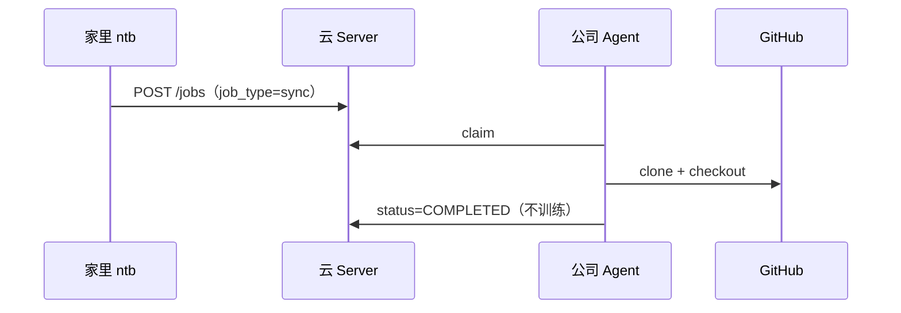

# NetTrainBridge

**版本 0.2** — 在家 `git push` 同步代码；**训练首选 Gradmotion（gm）**；gm 不可用时用 **`ntb train run`** 在公司训练机兜底；**`ntb test run`** 做真实 sim2sim。

**gm test 默认路径**：家里 `ntb` 从 gm 取 checkpoint 上传云 Server，训练机 Agent **pull** 后跑 `play.py`——训练机**无需** gm 凭证。详见 [docs/checkpoint-hub.md](docs/checkpoint-hub.md)。

| 文档 | 说明 |
|:---|:---|
| [cli/README.md](cli/README.md) | 家里 `ntb` 命令 |
| [server/README.md](server/README.md) | 云 Server |
| [agent/README.md](agent/README.md) | 训练机 Agent |
| [docs/acceptance.md](docs/acceptance.md) | sim2sim 验收清单 |
| [contrib/agi_origin/README.md](contrib/agi_origin/README.md) | 训练仓桥接脚本 |

## 做什么

- 家里 `git push` 同步代码到 GitHub
- **主路径**：在 gm 云端训练（`gm task create` + `run`）
- **兜底**：`ntb train run` 在公司训练机训练（gm 故障/环境不兼容时）
- **同步**：`ntb sync` 仅把代码拉到训练机，不训练
- 家里用 `ntb watch` 看 NTB 任务指标；ntb 兜底训练完成后 checkpoint 在 Server `data/{job_id}/`
- **测试**：`ntb test run` 创建 sim2sim 任务；gm 路径下家里自动 **stage** 模型到 Server，训练机 **pull** 后执行 `play.py`

无需内网穿透、无需 SSH 到训练机。

## 架构

### 总体拓扑

NetTrainBridge 是**三端 + 两条训练路径**的分布式训练桥接系统：

- **家里**：开发者本机，跑 `gm`（主训练）和 `ntb`（任务调度 / 监控 / sim2sim）
- **云服务器**：公网 FastAPI 中枢，任务队列 + 指标存储 + 产物归档
- **公司训练机**：内网 GPU 机，Agent 主动出站拉任务，无需开入站端口
- **Gradmotion**：云端 GPU，主路径训练（不经 NTB Agent）



**核心原则**：云服务器只做 API，不做训练；内网训练机只**出站**连 Server，无需 SSH / 内网穿透。

### 三端职责与配合

| 组件 | 部署位置 | 核心职责 | 对外连接 |
|:---|:---|:---|:---|
| **`ntb` CLI** | 家里 | 创建任务、查状态、看指标/日志/GPU、下载产物 | → 云 Server（HTTP 直连） |
| **Server** | 公网云 | 任务 CRUD、抢占调度、存指标/日志/模型、可选 Webhook | ← CLI / Agent；← GitHub |
| **Agent** | 公司 GPU 机 | 轮询抢任务、clone、train/sync/test、从 Server 拉模型 | → Server（经代理）；→ GitHub |
| **gm** | 家里 | 主路径云端训练；test 时由 **ntb** 代拉 checkpoint | → Gradmotion 云端 |
| **GitHub** | 公网 | 代码版本管理，`git push` 同步最新 commit | ← 家里 push；← Agent clone |

**配合关系**：

1. **家里 ↔ Server**：`ntb` 通过 HTTP 创建/查询任务，Server 是唯一「任务真相源」。
2. **Agent ↔ Server**：Agent 定时抢占任务；并行上报日志、指标、GPU 心跳；train 结束上传 checkpoint；test 成功上传 **`isaac_diag_*.csv`**（流式 metrics 仍走 DB）。
3. **Agent ↔ GitHub**：按任务里的 `repo_url` + `commit_sha` clone/checkout，保证训练代码版本可追溯。
4. **家里 ↔ gm（test 时）**：`ntb test run --gm-task-id` 用 `cli.gm_api_key` 查 checkpoint、下载 OSS 直链，上传到 Server（Plan 03）。
5. **Agent ↔ Server（test pull）**：gm test 默认从 **本 job** 的 `data/{id}/models/` 下载模型到同窗 logs 路径；ntb test 从**父 train job** 下载。
6. **gm ↔ NTB**：gm 训练与 NTB 解耦——gm 产模型，NTB 负责 staging + 公司机真实 sim2sim。

### 任务类型与执行分工

| `job_type` | 触发方 | 执行方 | 做什么 |
|:---|:---|:---|:---|
| **`train`** | `ntb train run`（兜底） | Agent | clone → `train_with_metrics.py` → 上报指标 → 上传 checkpoint |
| **`sync`** | `ntb sync` | Agent | 仅 clone/checkout 代码到训练机 workspace，不启动训练 |
| **`test`** | `ntb test run` | Agent | sync → **pull**（gm，默认）或 fetch（`--fetch-from-gm`）→ `play.py` sim2sim |

主路径训练走 **gm**，不创建 NTB `train` 任务；NTB `train` 仅在 gm 不可用或环境不兼容时作兜底。

### 整体运行图

#### 路径 A — 主训练（gm，推荐）



#### 路径 B — 兜底训练（ntb train）



#### 路径 C — sim2sim 验证（ntb test，Plan 03 默认）



可选旧路径：`ntb test run ... --fetch-from-gm` 时 Agent 仍直拉 gm（5B 兜底）。

#### 路径 D — 仅同步代码（ntb sync）



### 任务状态机

```
PENDING → ASSIGNED → RUNNING → COMPLETED / FAILED
   ↑          ↑           ↑
 创建任务   Agent抢占   子进程启动
（CLI/Webhook）        （train/play）
```

- **PENDING**：Server 已记录 `repo_url` + `commit_sha`，等待 Agent。
- **ASSIGNED**：某 Agent `claim` 成功，开始 clone/准备环境。
- **RUNNING**：训练或 sim2sim 子进程已启动，指标/日志/GPU 持续上报。
- **COMPLETED / FAILED**：进程结束；成功时 checkpoint / meta 写入 `server/data/{job_id}/`。

### 数据流与存储

| 数据 | 存放位置 | 写入方 | 读取方 |
|:---|:---|:---|:---|
| 任务元数据、指标时序 | 云 SQLite | Server（收 Agent POST） | `ntb jobs` / `watch` |
| 实时日志（最近 5000 行） | 云内存 | Agent `POST /logs` | `ntb logs` / `logs -f`（SSE） |
| checkpoint、meta.json、test 产物 | 云磁盘 `data/{job_id}/` | Agent 上传 | `ntb job`、HTTP 下载 |
| test 流式指标 | 云 SQLite | Agent `POST /metrics` | `ntb metrics` / `watch` |
| sim2sim 诊断 CSV | `data/{job_id}/test/isaac_diag_*.csv` | Agent test 成功后上传 | `ntb artifacts download` |
| 中间 checkpoint | 训练机本地 workspace | 训练脚本 | Agent 断点续训（不上传） |
| 训练代码 | GitHub | 开发者 push | Agent clone |

### Server API 模块（按职责）

| 路由前缀 | 用途 |
|:---|:---|
| `/jobs` | 任务 CRUD、抢占、状态、phase |
| `/jobs/{id}/metrics` | 训练指标读写 |
| `/jobs/{id}/logs` | 日志写入、查询、SSE 流 |
| `/jobs/{id}/heartbeat` | GPU 利用率 / 显存 |
| `/jobs/{id}/checkpoint` | 模型上传与下载 |
| `/jobs/{id}/meta` | 训练来源、gm_task_id、load_run、fetch_mode、checkpoint_staged |
| `/jobs/{id}/test/*` | sim2sim 产物 |
| `/webhook/github` | 可选：push 自动建任务 |

### 配置贯通

三端共用 `~/.nettrainbridge/config.json`（环境变量 > 配置文件 > 默认值）：

```text
config.json
├── cli.server_url      → 家里 ntb 连哪台 Server
├── cli.gm_api_key      → 家里从 gm 取模（test stage，Plan 03）
├── cli.gm_base_url     → gm API 地址
├── agent.server_url    → 训练机 Agent 连哪台 Server
├── agent.proxy         → 公司出网代理
├── agent.workspace     → 任务工作目录根
├── agent.train_command → 兜底训练命令模板
├── agent.gm_api_key    → 可选，仅 --fetch-from-gm 兜底时需要
└── server.*            → 云 Server 监听端口、Webhook 白名单
```

## 三端分工


| 角色         | conda      | 安装                            | `pip install -e .`？ |
| ---------- | ---------- | ----------------------------- | ------------------- |
| **云服务器**   | `nettrain` | `server/requirements.txt`     | 否                   |
| **训练机**    | `F1`       | `agent/requirements.txt`      | 否                   |
| **家里 CLI** | 任意 3.8+    | 仓库根 `pip install -e ".[dev]"` | 是（仅此处）              |


## 启动

配置文件路径：`~/.nettrainbridge/config.json`（三端共用；优先级：环境变量 > 配置文件 > 默认值）。

### 云服务器

**配置（首次）**

```bash
mkdir -p ~/.nettrainbridge
cp nettrainbridge_common/config.example.json ~/.nettrainbridge/config.json
```

编辑 `server` 段（按需改 `webhook_secret`、`allowed_repos`）：

```json
"server": {
  "host": "0.0.0.0",
  "port": 8000,
  "webhook_secret": "",
  "allowed_repos": ["https://github.com/Lee-Weather/agi_origin.git"]
}
```

**启动**

```bash
git pull
conda activate nettrain
cd server && pip install -r requirements.txt   # 首次
python main.py
```

启动日志应出现 `配置文件: ~/.nettrainbridge/config.json`。  
自检：`curl http://127.0.0.1:8000/health`

### 训练机

**配置（首次）**

```bash
mkdir -p ~/.nettrainbridge
cp nettrainbridge_common/config.example.json ~/.nettrainbridge/config.json
```

编辑 `agent` 段（`proxy` 按公司实际代理修改；**默认无需** `gm_api_key`）：

```json
"agent": {
  "server_url": "http://47.103.63.175:8000",
  "proxy": "http://10.12.201.122:39000",
  "agent_id": "agent-001",
  "workspace": "~/czy/nettrainbridge",
  "conda_env": "F1",
  "train_command": "python humanoid/scripts/train_with_metrics.py --task=x1_dh_stand --run_name={job_id} --headless"
}
```

仅在使用 `ntb test run --fetch-from-gm` 旧路径时，才需在 agent 段配置 `gm_api_key` / `gm_base_url`。

**启动**

```bash
git pull
conda activate F1
cd agent && pip install -r requirements.txt   # 首次
python agent.py
```

启动日志应出现 Agent ID、服务器地址、workspace。  
自检：`curl -x http://10.12.201.122:39000 http://47.103.63.175:8000/health`

### 家里（监控）

**配置（首次）**

```bash
pip install -e ".[dev]"
ntb config init
```

或手动复制模板后编辑 `cli` 段（**gm test 须配 `gm_api_key`**）：

```json
"cli": {
  "server_url": "http://47.103.63.175:8000",
  "gm_api_key": "<与 gm CLI 同账号的 API Key>",
  "gm_base_url": "https://internal.limxdynamics.com/dev-api"
}
```

**使用**

```bash
ntb health
ntb sync                 # 仅同步代码到训练机
ntb train run            # 兜底训练（gm 不可用时）
ntb train run --watch
ntb test run --gm-task-id TASK_xxx --load-run <load_run> --watch   # gm → sim2sim
ntb checkpoint stage-from-gm <job_id> --task-id TASK_xxx           # 手动补传模型
ntb jobs
ntb job <job_id>         # 含类型、phase、fetch_mode、meta
ntb watch <job_id>
```

完整 CLI 说明见 [cli/README.md](cli/README.md)。

未安装包时：`python cli/ntb.py` 或 `python -m nettrainbridge_cli`（同样读 `~/.nettrainbridge/config.json`）。

### 端到端顺序

```text
【主路径 — gm 训练】
1. git push
2. gm task create + gm task run
3. gm task logs --follow

【gm 训练 → sim2sim test（Plan 03）】
1. git push
2. gm task create + gm task run
3. gm task logs --follow
4. 家里配置 cli.gm_api_key
5. ntb test run --gm-task-id TASK_xxx --load-run <load_run> --watch

【兜底 — ntb 训练】
1. 云服务器  python main.py
2. 训练机    python agent.py
3. 家里      git push
4. 家里      ntb train run [--watch]
5. 家里      ntb job <id>   # 完成后可见 train_source=ntb

【仅同步代码】
ntb sync --commit <sha>
```

验收（云服务器 `server/` 目录）：

```bash
bash test_phase3.sh http://localhost:8000
bash test_cli.sh http://localhost:8000
```

## GitHub Webhook（可选，默认不用）

手动触发模式下 **无需配置 Webhook**。若 GitHub 上仍保留旧的 push Webhook，请在仓库 Settings → Webhooks 中 **Disable 或 Delete**，避免 push 时重复创建任务。

如需恢复 push 自动触发，可重新启用 Webhook：

在 [agi_origin](https://github.com/Lee-Weather/agi_origin) → Settings → Webhooks：


| 项            | 值                                     |
| ------------ | ------------------------------------- |
| Payload URL  | `http://<云服务器IP>:8000/webhook/github` |
| Content type | `application/json`                    |
| Events       | Just the push event                   |


## CLI 速查

完整帮助：`ntb --help`、`ntb <命令> --help`。

### 全局选项（所有子命令可用）


| 选项             | 说明               |
| -------------- | ---------------- |
| `--server URL` | 临时指定云服务器（覆盖配置文件） |
| `--json`       | 输出原始 JSON        |


配置文件 `cli.server_url`；可选 `api_token`（或环境变量 `NETTRAINBRIDGE_API_TOKEN`）用于 Bearer 认证。

### 命令


| 命令 | 说明 |
|:---|:---|
| `ntb health` | 服务器健康检查 |
| `ntb sync` | 仅同步代码到训练机（不训练） |
| `ntb train run` | **兜底**训练任务（`job_type=train`） |
| `ntb test run` | 创建 sim2sim 测试（gm / ntb 双入口） |
| `ntb checkpoint upload` | 上传 .pt 到 Server |
| `ntb checkpoint stage-from-gm` | 从 gm 取模并上传到指定 job |
| `ntb checkpoint list/download` | 列出 / 下载 Server 上的模型 |
| `ntb artifacts list/download` | test 产物（`isaac_diag_*.csv`） |
| `ntb jobs` | 任务列表 |
| `ntb job <id>` | 单任务详情（含 meta 训练来源/模型） |
| `ntb trigger` | 已弃用，等同 `train run` |
| `ntb metrics <id>`   | 训练指标表格                             |
| `ntb heartbeat <id>` | 最新 GPU 心跳（利用率、显存）                  |
| `ntb logs <id>`      | 查询日志                               |
| `ntb logs <id> -f`   | SSE 实时跟踪日志                         |
| `ntb watch <id>`     | 综合监控（指标 + GPU，默认 5s 轮询）            |
| `ntb config init`    | 生成 `~/.nettrainbridge/config.json` |
| `ntb config path`    | 显示配置文件查找路径                         |


### 常用参数


| 命令 | 参数 | 说明 |
|:---|:---|:---|
| `train run` / `sync` | `--repo URL` | 仓库地址（默认 `git remote get-url origin`） |
| `train run` / `sync` | `--commit SHA` | Commit SHA（默认当前 HEAD） |
| `train run` / `sync` | `--branch NAME` | 分支名（与 `--commit` 互斥） |
| `train run` | `--watch` | 创建后立即 watch |
| `train run` | `--interval SEC` | watch 轮询间隔（默认 5） |
| `test run` | `--gm-task-id` / `--train-job-id` | 二选一；gm 路径默认自动 stage |
| `test run` | `--load-run` | **必填**；play.py 加载用 logs 目录名 |
| `test run` | `--fetch-from-gm` | 训练机直拉 gm（旧 5B 兜底） |
| `test run` | `--no-stage-checkpoint` | 不自动上传 Server，改用手动 stage |
| `trigger` | （同 train run） | 已弃用 |
| `jobs`        | `--status STATUS`  | 筛选：`PENDING` / `ASSIGNED` / `RUNNING` / `COMPLETED` / `FAILED` |
| `jobs`        | `--limit N`        | 最多返回 N 条（默认 20）                                                |
| `metrics`     | `--limit N`        | 最近 N 条指标                                                       |
| `metrics`     | `--since-step N`   | 只返回 step > N 的记录                                               |
| `logs`        | `--tail N`         | 只显示最后 N 行                                                      |
| `watch`       | `--interval SEC`   | 轮询间隔秒数（默认 5）                                                   |
| `watch`       | `--once`           | 只拉一轮（脚本/调试）                                                    |
| `config init` | `--server-url URL` | 写入的服务器地址                                                       |
| `config init` | `--path PATH`      | 自定义写入路径                                                        |
| `config init` | `--force`          | 覆盖已有文件                                                         |


### 示例

```bash
cd agi_origin && git push
gm task run --task-id TASK_xxx
ntb test run --gm-task-id TASK_xxx --load-run 2026-01-14_09-58-10test_20_video --watch
ntb train run --watch
ntb sync --commit $(git rev-parse HEAD)
```

## 任务状态

```
PENDING → ASSIGNED → RUNNING → COMPLETED / FAILED
```

## 目录概览

```
NetTrainBridge/
├── server/          # 云 API
├── agent/           # 训练机 Agent
├── cli/             # ntb 客户端
├── nettrainbridge_common/   # 共享配置加载 + config.example.json
├── contrib/         # 推送到训练仓的桥接脚本
├── docs/            # 现行文档（checkpoint 中转、验收清单）
└── config_loader.py # 兼容层（转发到 nettrainbridge_common）
```

设计与验收见 [docs/README.md](docs/README.md)；gm test checkpoint 中转见 [docs/checkpoint-hub.md](docs/checkpoint-hub.md)。
