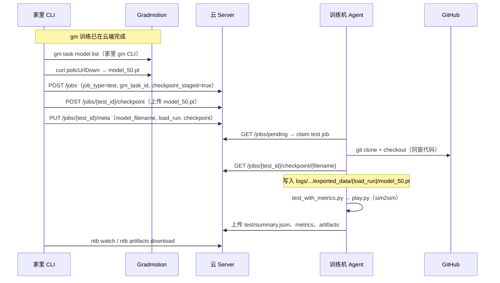

# Plan 03：gm test checkpoint 中转（CLI → Server → Agent）

> **状态**：🚧 实施中（Plan 03 代码已落地，待 E2E 验收）  
> **决策**：gm 训练后的 `ntb test run` **默认**走 **CLI → Server → Agent**；训练机 Agent **不再依赖** gm API Key / OSS 直链。  
> **替代**：v0.2 **5B**（Agent 经代理直拉 `policUrlDown`）降为**可选兜底**（`--fetch-from-gm`）。  
> 关联：[plan02-gm-ntb-framework.md](../plan02-gm-ntb-framework.md) §6 FETCH 5B、[r1-3-manual-acceptance.md](../r1-3-manual-acceptance.md)

---

## 1. 背景与动机

### 1.1 现状（v0.2 / R1-3）

| 路径 | 模型来源 | 训练机是否需要 gm 凭证 |
|:---|:---|:---|
| `ntb test run --train-job-id` | Server 父 train job | **否** |
| `ntb test run --gm-task-id` | Agent FETCH → gm OSS | **是**（`gm_api_key` + 代理/OSS） |

gm test 流程：

```text
家里 ntb test run --gm-task-id
  → Agent sync
  → Agent FETCH（gm API list + OSS 下载 model_*.pt）
  → Agent 上传 Server（副本）
  → sim2sim
```

### 1.2 R1-3 暴露的问题

| 问题 | 表现 |
|:---|:---|
| 鉴权头错误 | `Authorization: Bearer` 导致 gm API 401（已修为 `X-Api-Key`） |
| OSS 403 | 训练机经公司代理访问 `*.aliyuncs.com` 被拒 |
| 凭证双份 | 家里 gm CLI（keychain）+ 训练机 `config.json` 各维护一套 |
| 职责混乱 | 训练机既要连 Server，又要连 gm 内网 + 外网 OSS |

### 1.3 目标

```text
gm 训练结束
  → 家里 gm CLI 取最新 checkpoint
  → 家里 ntb 上传到 Server（test job）
  → 训练机 claim test → 从 Server 下载 → sim2sim
```

**gm API Key 仅存在于家里（gm CLI / ntb CLI 配置）**；训练机配置更整洁。

---

## 2. 架构决策

### 2.1 核心原则

| 原则 | 说明 |
|:---|:---|
| **Server 作 checkpoint 中转站** | 与 ntb train → test 路径统一；训练机只信任 Server |
| **gm 凭证家里独享** | `gm_api_key` / `gm_base_url` 从 Agent `config.json` **移除（推荐）** 或标为可选 |
| **追溯性保留** | meta 仍记录 `gm_task_id`、`gm_checkpoint`、`load_run`、`commit_sha` |
| **向后兼容** | 保留 Agent 直拉 gm（`--fetch-from-gm`），默认关闭 |
| **出站-only 不变** | 训练机仍只主动访问外网（Server、GitHub）；不新增入站 |

### 2.2 与 v0.2 5B 的关系

| 项 | v0.2 5B | Plan 03（新默认） |
|:---|:---|:---|
| 谁从 gm 取模 | 训练机 Agent | **家里 CLI** |
| 谁访问 OSS | 训练机 | **家里**（gm CLI / curl） |
| 训练机 gm 配置 | 必需 | **不需要** |
| Server `models/` | Agent FETCH 后写入 | **CLI 预先写入** |
| test 阶段 | `sync` → `fetch` → `test` | `sync` → **`pull`** → `test`（或跳过 fetch） |

### 2.3 三端职责（新）

```
┌──────────────┐                    ┌──────────────┐
│  家里         │  gm task model     │  Gradmotion  │
│  gm CLI      │ ─────────────────▶ │  + OSS       │
│  ntb CLI     │ ◀── policUrlDown ──│              │
└──────┬───────┘                    └──────────────┘
       │ POST /jobs（test）
       │ POST /jobs/{id}/checkpoint（上传 .pt）
       ▼
┌──────────────┐   GET checkpoint    ┌──────────────┐
│  云 Server   │ ◀──────────────── │  训练机       │
│  data/{id}/  │ ─────────────────▶ │  Agent       │
│  models/     │   clone + sim2sim  │  （无 gm key）│
└──────────────┘                    └──────────────┘
```

---

## 3. 端到端流程

### 3.1 主路径（gm 训练 → sim2sim test）



### 3.2 与 ntb train → test 的统一

两条 test 入口在 **「从 Server 取 checkpoint」** 上收敛：

| 入口 | `train_source` | checkpoint 在 Server 的位置 |
|:---|:---|:---|
| `--train-job-id` | `ntb` | 父 train job `data/{parent_id}/models/` |
| `--gm-task-id`（新默认） | `gm` | **本 test job** `data/{test_id}/models/`（家里预上传） |

Agent test 阶段解析逻辑可共用：**优先本地 logs 路径 → 否则从 Server 下载到同窗路径**。

### 3.3 时序约束

| 约束 | 说明 |
|:---|:---|
| **先上传再 claim** | 理想：CLI 在上传完成后再让 Agent 看见可执行 job；或 Agent 在 pull 阶段等待 Server 有文件 |
| **超时重试** | Agent `pull` 阶段若 Server 无 checkpoint：短轮询（如 30s×N）后 FAILED，提示「家里尚未上传」 |
| **幂等** | 同一 test job 重复上传同文件名：覆盖或拒绝（Server 约定见 §5.2） |

---

## 4. 元数据与状态机

### 4.1 新增 / 调整 meta 字段

写入 `data/{job_id}/meta.json` 与 `PUT /jobs/{id}/meta`：

| 字段 | 类型 | 说明 |
|:---|:---|:---|
| `checkpoint_staged` | `bool` | `true` = 家里已（或将）把模型放上 Server，Agent **不走 gm FETCH** |
| `checkpoint_staged_at` | ISO8601 可选 | 家里上传完成时间 |
| `model_filename` | `str` | 如 `model_50.pt` |
| `model_path` | `str` 可选 | 训练机内相对路径（Agent pull 后写入） |
| `gm_task_id` | `str` | 保留，追溯用 |
| `gm_checkpoint` | `str` | 保留，如 `50` / `latest` |
| `load_run` | `str` | 必填，play.py 加载用 |
| `checkpoint` | `int` | sim2sim 整数 checkpoint |
| `task` | `str` | 默认 `x1_dh_stand` |
| `fetch_mode` | `str` 可选 | `server`（默认）\| `gm`（兜底直拉） |

### 4.2 test job 阶段（phase）

| phase | 含义 | Plan 03 行为 |
|:---|:---|:---|
| `sync` | clone 代码 | 不变 |
| `fetch` | 从 gm OSS 拉模 | **仅 `fetch_mode=gm` 时** |
| `pull` | **新增**：从 Server 拉模到 logs 布局 | `checkpoint_staged=true` 时 sync 后进入 |
| `test` | sim2sim | 不变 |
| `done` | 完成 | 不变 |

状态迁移：

```text
checkpoint_staged=true, fetch_mode≠gm:
  sync → pull → test → done

fetch_mode=gm（兜底）:
  sync → fetch → test → done   # 与 v0.2 相同

train_source=ntb（父任务）:
  sync → test → done           # 不变；test 内从 parent 下载
```

### 4.3 `train_source` 不变

仍用 `gm` / `ntb` 区分训练来源；**不新增** `train_source=gm-staged`。  
是否走 Server 由 `checkpoint_staged` + `fetch_mode` 表达。

---

## 5. 接口变更

### 5.1 Server（少量增强）

现有能力（**已实现**，Plan 03 复用）：

| 方法 | 路径 | 用途 |
|:---|:---|:---|
| `POST` | `/jobs` | 创建 test job |
| `POST` | `/jobs/{id}/checkpoint?chunk_index=&total_chunks=` | 分片上传模型 |
| `GET` | `/jobs/{id}/checkpoint` | 列出 models/ |
| `GET` | `/jobs/{id}/checkpoint/{filename}` | 下载 |
| `PUT` | `/jobs/{id}/meta` | 写 meta |

**建议增强**（可选，P1）：

| 增强 | 说明 |
|:---|:---|
| 创建 test 时接受 `checkpoint_staged: true` | 写入 meta + DB；`phase` 初始为 `sync` |
| `GET /jobs/{id}/checkpoint` 返回 `ready: true/false` | CLI / Agent 判断上传是否完成 |
| 上传完成回调 | 大文件分片合并后自动 `checkpoint_staged_at`（或靠 CLI 再 PUT meta） |

**无需** 新存储目录；仍用 `data/{test_job_id}/models/`。

### 5.2 CLI（主要新增）

#### 5.2.1 新命令

```bash
# 上传 checkpoint 到指定 job（封装已有 POST /checkpoint）
ntb checkpoint upload <job_id> -f ./model_50.pt [--filename model_50.pt]

# 可选：从 gm 一步拉取并上传（家里执行，封装 gm list + curl + upload）
ntb checkpoint stage-from-gm \
  --task-id TASK_xxx \
  --checkpoint 50 \
  --job-id <test_job_id>   # 或内部先 create test job
```

#### 5.2.2 扩展 `ntb test run`

**方案 A（推荐）：两步式，清晰可控**

```bash
# 1. 创建 test job（不在训练机 FETCH）
ntb test run --gm-task-id TASK_xxx --load-run <load_run> --checkpoint 50 --no-watch
# → 返回 test_job_id，meta.checkpoint_staged=false

# 2. 家里从 gm 取模并上传
ntb checkpoint stage-from-gm --task-id TASK_xxx --checkpoint 50 --job-id <test_job_id>

# 3. 标记 staged 并监控
ntb job meta set <test_job_id> checkpoint_staged true   # 或由 stage-from-gm 自动完成
ntb watch <test_job_id>
```

**方案 B（便捷）：一步式**

```bash
ntb test run --gm-task-id TASK_xxx --load-run <load_run> --checkpoint 50 \
  --stage-checkpoint   # 家里自动：gm 下载 → 上传 Server → 再 watch
```

| 参数 | 默认 | 说明 |
|:---|:---|:---|
| `--stage-checkpoint` | **true**（Plan 03 后） | 家里 gm 取模并上传 Server |
| `--fetch-from-gm` | false | 强制训练机 Agent 走旧 5B FETCH |
| `--stage-checkpoint` + `--fetch-from-gm` | 互斥 | CLI 报错 |

#### 5.2.3 CLI gm 配置

家里 `~/.nettrainbridge/config.json`：

```json
{
  "cli": {
    "server_url": "http://47.103.63.175:8000",
    "gm_api_key": "<与 gm CLI 同账号>",
    "gm_base_url": "https://internal.limxdynamics.com/dev-api"
  }
}
```

| 配置项 | 段 | 说明 |
|:---|:---|:---|
| `gm_api_key` | `cli` | **新增**；家里专用 |
| `gm_base_url` | `cli` | **新增**；与 `gm config get base_url` 一致 |

环境变量：`GM_API_KEY` / `GM_BASE_URL`（CLI 读配置时与 agent 段优先级一致）。

#### 5.2.4 实现要点

- `checkpoint upload`：复用 Agent 同款分片协议（`chunk_index` / `total_chunks`）；单文件 `total_chunks=1` 即可。
- `stage-from-gm`：调用 gm OpenAPI 使用 **`X-Api-Key`**（与 Agent 修复一致）；OSS 下载**不带**鉴权头。
- 上传完成后：`PUT meta` 设置 `checkpoint_staged=true`、`model_filename`、`checkpoint`（int）。

### 5.3 Agent（收敛 FETCH，新增 PULL）

#### 5.3.1 配置精简

| 项 | Plan 03 后 |
|:---|:---|
| `agent.gm_api_key` | **删除或留空**（仅 `--fetch-from-gm` 时需要） |
| `agent.gm_base_url` | 同上 |
| `agent.proxy` | 保留（连 Server、GitHub） |

`config.example.json`：agent 段去掉 gm 字段或注释为「仅 fetch-from-gm 兜底需要」。

#### 5.3.2 `_run_test_job` 分支

```text
sync 完成后：
  if fetch_mode == "gm":
      phase = fetch  → 现有 FetchRunner（gm OSS）
  elif checkpoint_staged:
      phase = pull   → 新增 PullRunner（从 Server 本 job 或约定路径下载）
  elif train_source == "ntb" and parent_train_job_id:
      phase = test   → 现有 test_context 从 parent 下载
  else:
      FAILED（缺少 staged 模型或 parent）
```

#### 5.3.3 新增 `PullRunner`（或扩展 `test_context`）

职责：

1. `GET /jobs/{job_id}/checkpoint` 确认文件存在；
2. `download_checkpoint(job_id, model_filename, dest)`；
3. 目标路径：`logs/{task}/exported_data/{load_run}/model_{checkpoint}.pt`（与 R1-2 布局一致）；
4. `PUT meta` 更新 `model_path`；
5. `update_phase("test")`。

**与 ntb 父任务下载共用** `api_client.download_checkpoint()`；差异仅为 `job_id` 是本 test job 而非 parent。

#### 5.3.4 `resolve_test_context` 调整

gm + staged 路径：与现 `_resolve_gm_model` 相同，检查本地 logs 是否已有文件（pull 后应存在）。

可选：删除 Agent FETCH 成功后「再上传 Server」步骤（模型已由家里上传）；**保留亦可**（Server 双份一致，便于家里 `ntb checkpoint download`）。

---

## 6. 分步实施计划

| 步骤 | 模块 | 交付 | 验收 |
|:---|:---|:---|:---|
| **03-0** | 文档 | 本文件 + 更新 `cli/README.md` 场景 A | 评审通过 |
| **03-1** | CLI | `ntb checkpoint upload` | 上传后 `ntb checkpoint list` 可见 |
| **03-2** | CLI | `ntb checkpoint stage-from-gm` + cli 段 `gm_*` 配置 | 家里一条命令完成 gm→Server |
| **03-3** | Server | 创建 test 支持 `checkpoint_staged`；meta 字段 | `POST /jobs` + GET meta 正确 |
| **03-4** | Agent | `pull` 阶段 + `PullRunner` | mock Server 文件 → logs 路径正确 |
| **03-5** | CLI | `ntb test run --stage-checkpoint`（默认 true） | 端到端无 Agent gm 配置 |
| **03-6** | Agent | `--fetch-from-gm` 保留旧 FETCH；默认关闭 | 回归旧 5B 用例可选跑 |
| **03-7** | 文档 | 更新 `r1-3-manual-acceptance.md`、根 `README.md` 路径 C 序列图 | 手册与实现一致 |
| **03-8** | 清理 | `config.example.json` agent 去 gm；`gm_probe.py` 标为可选 | 训练机最小配置清单 |

依赖关系：

```text
03-0 → 03-1 → 03-2 → 03-5 → 03-8
         ↘ 03-3 ↗
              03-4 → 03-5
              03-6（可与 03-4 并行）
```

---

## 7. 文件级改动清单

| 路径 | 改动 |
|:---|:---|
| `cli/nettrainbridge_cli/main.py` | `checkpoint upload`、`stage-from-gm`；`test run` 新参数 |
| `nettrainbridge_common/config_loader.py` | cli 段读 `gm_api_key` / `gm_base_url`（若无则不改） |
| `config.example.json` | `cli.gm_*` 示例；agent `gm_*` 注释可选 |
| `server/models.py` | `JobCreate` 增加 `checkpoint_staged`、`fetch_mode` 可选 |
| `server/api/jobs.py` | 创建 test 写 meta；解析 `fetch_mode` |
| `agent/agent.py` | sync 后分支：`pull` / `fetch` / 直接 `test` |
| `agent/pull_runner.py` | **新建**（或合并进 `test_context.py`） |
| `agent/test_context.py` | staged gm 与 ntb parent 统一解析 |
| `agent/config.py` | gm 字段标为可选，文档说明 |
| `cli/README.md` | 场景 A 改为 CLI stage 流程 |
| `plan/r1-3-manual-acceptance.md` | 场景 A 重写 |
| `README.md` | 路径 C 序列图更新 |
| `plan/plan02-gm-ntb-framework.md` | §6 加注「Plan 03  supersede 默认路径」 |

**可不删**：`agent/gm_client.py`、`agent/fetch_runner.py`（兜底 `--fetch-from-gm`）。

---

## 8. 日常命令（Plan 03 后）

### 8.1 gm 训练 → sim2sim（主路径）

```bash
# 家里：gm 训练完成后
gm task model list --task-id TASK_20260605_042 --checkpoint 50

# 一条命令（03-5 后）
ntb test run \
  --gm-task-id TASK_20260605_042 \
  --load-run "2026-01-14_09-58-10test_20_video" \
  --checkpoint 50 \
  --commit <sha> \
  --watch

# 内部分步：create job → stage-from-gm → Agent pull → sim2sim
```

### 8.2 分步（调试 / 大模型）

```bash
TEST_ID=$(ntb test run --gm-task-id TASK_xxx --load-run ... --checkpoint 50 --json | jq -r .id)
ntb checkpoint stage-from-gm --task-id TASK_xxx --checkpoint 50 --job-id "$TEST_ID"
ntb watch "$TEST_ID"
```

### 8.3 兜底：训练机直拉 gm（不推荐）

```bash
ntb test run --gm-task-id TASK_xxx --load-run ... --fetch-from-gm --watch
# 训练机仍需 agent.gm_api_key + 网络可达 OSS
```

### 8.4 ntb 训练 → test（不变）

```bash
ntb train run --watch
ntb test run --train-job-id <train_job_id> --load-run ... --checkpoint 3000 --watch
```

---

## 9. 训练机最小配置（Plan 03 后）

```json
{
  "agent": {
    "server_url": "http://47.103.63.175:8000",
    "proxy": "http://10.12.201.122:39000",
    "agent_id": "agent-001",
    "workspace": "~/czy/nettrainbridge",
    "conda_env": "F1"
  }
}
```

**不再需要**：`gm_api_key`、`gm_base_url`。

---

## 10. 风险与对策

| 风险 | 对策 |
|:---|:---|
| 家里上传大模型慢 | 分片上传已有；显示进度；可选仅上传一次，Server 保留供多次 test |
| Agent 先于上传 claim | `pull` 阶段轮询 Server；meta `checkpoint_staged=false` 时 Agent 等待或 PENDING 子状态 |
| Server 磁盘 | 与现 5B 相同（本就要存 `models/`）；清理策略见 plan02 TBD #7 |
| 与旧 Agent 不兼容 | Server meta 默认 `checkpoint_staged=false` + 文档要求先升 CLI/Agent |
| 家里也需 gm 凭证 | 本来就有 gm CLI；集中到 `cli` 段更符合使用场景 |

---

## 11. 验收标准

| # | 检查项 | 命令 / 期望 |
|:---|:---|:---|
| 1 | 训练机无 gm 配置可完成 gm test | Agent `config.json` 无 `gm_*`；test COMPLETED |
| 2 | CLI 可 stage | `ntb checkpoint stage-from-gm` → Server `models/model_*.pt` 存在 |
| 3 | Agent pull 布局正确 | 训练机 `{job}/logs/x1_dh_stand/exported_data/{load_run}/model_50.pt` |
| 4 | sim2sim 真实指标 | `summary.json` 无 `"mock": true` |
| 5 | 家里可下载 | `ntb checkpoint download <test_job_id>` |
| 6 | meta 追溯 | `gm_task_id`、`checkpoint`、`load_run`、`checkpoint_staged=true` |
| 7 | 兜底仍可用 | `--fetch-from-gm` 在配置 gm 的训练机上仍可 FETCH |
| 8 | ntb test 回归 | `--train-job-id` 路径不受影响 |

建议验收脚本：`plan/03plan/validate-03.sh`（03-8 补充）。

---

## 12. 与现有计划的关系

| 文档 | 关系 |
|:---|:---|
| [plan02-gm-ntb-framework.md](../plan02-gm-ntb-framework.md) | §6 **5B 默认路径由 Plan 03 取代**；5B 降为兜底 |
| [plan02-implementation.md](../plan02-implementation.md) | 步骤 6 FETCH 仍有效，非默认 |
| [r1-sim2sim-plan.md](../r1-sim2sim-plan.md) | R1-2 logs 布局不变；FETCH 来源改为 Server |
| [r1-3-manual-acceptance.md](../r1-3-manual-acceptance.md) | 场景 A 按 §8 更新 |

---

## 13. 开放问题（TBD）

| # | 议题 | 倾向 |
|:---|:---|:---|
| 1 | 默认 `--stage-checkpoint` 还是显式传参 | **默认 true**（新用户零 gm 训练机配置） |
| 2 | `pull` 是否单独 phase 或并入 `test` 开头 | **独立 `pull` phase**（watch 可观测） |
| 3 | staged 后 Agent 是否再上传 Server | **否**（避免重复流量）；家里已上传 |
| 4 | CLI `stage-from-gm` 是否内嵌于 `test run` | 提供 **两种**（§5.2.2 方案 A/B） |
| 5 | plan02 文档是否回写「5B 已废弃」 | 标注 **superseded by Plan 03**，非删除 |

---

## 14. 小结

Plan 03 将 gm test 的 checkpoint 链路从 **「训练机直拉 gm/OSS」** 调整为 **「家里经 Server 中转」**，与 ntb test 的 Server 枢纽模型对齐，并消除训练机上的 gm 凭证与 OSS 网络依赖。实现上 **大量复用已有 Server 上传/下载 API 与 Agent `download_checkpoint`**，主要增量在 **CLI upload/stage** 与 **Agent pull 分支**。
